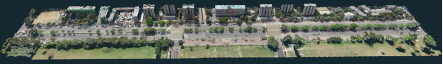

# Quantifying Aboveground Carbon Stock at Species Level

## Overview

This project quantifies the aboveground carbon stock of urban trees at the species level. By integrating Terrestrial Laser Scanning (TLS) LiDAR and Unmanned Aerial Vehicle (UAV) photogrammetry, we achieved high-precision structural measurements of urban forestry. The findings contribute to a better understanding of the role urban trees play in carbon sequestration.

**Study Area:** Urban Tree Coverage
**Data:** TLS LiDAR, UAV Photogrammetry
**Status:** Published (2025)

---

## Interactive 3D Point Cloud Video

Check out the detailed photogrammetry and point cloud reconstruction of the study area:

<video width="100%" controls autoplay muted loop playsinline style="border-radius: 8px; margin: 1rem 0;">
  <source src="../../assets/images/photogrammetry_compiled.mp4" type="video/mp4">
  Your browser does not support the video tag.
</video>

---

## Methods & Tools

**Data Sources**
- **TLS LiDAR Data**: High-resolution terrestrial laser scanning for tree trunk and branch architecture.
- **UAV Photogrammetry**: Aerial imaging to reconstruct canopy structures and spatial distribution.

**Key Tools Used**
- **LiDAR Processing Software**: For point cloud classification and structural metric extraction.
- **Photogrammetry Software**: To generate orthomosaics and 3D models.
- **Geospatial Analysis**: Used to map species distribution and calculate biomass indices.

---

## Links

[View Published Chapter 🔗](https://www.intechopen.com/chapters/1212084){ .md-button }
