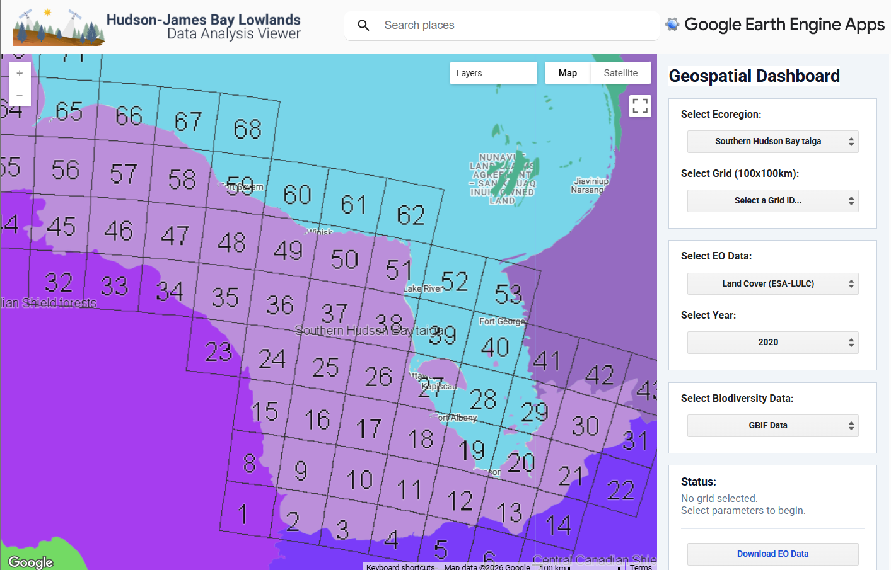
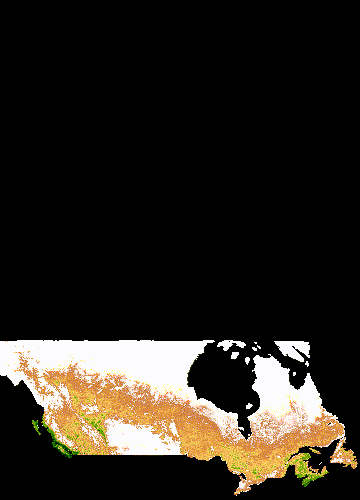
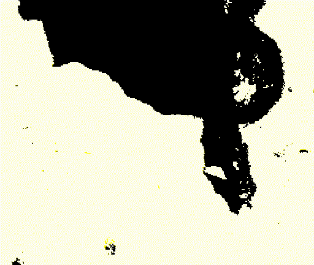
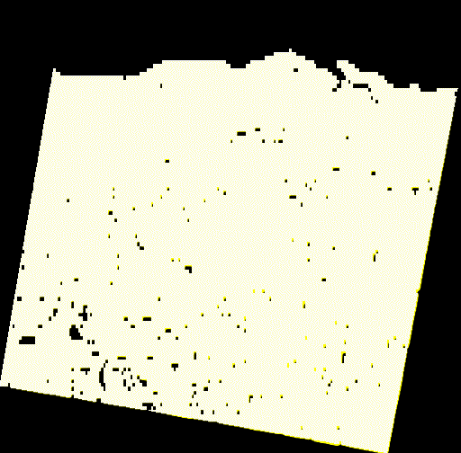
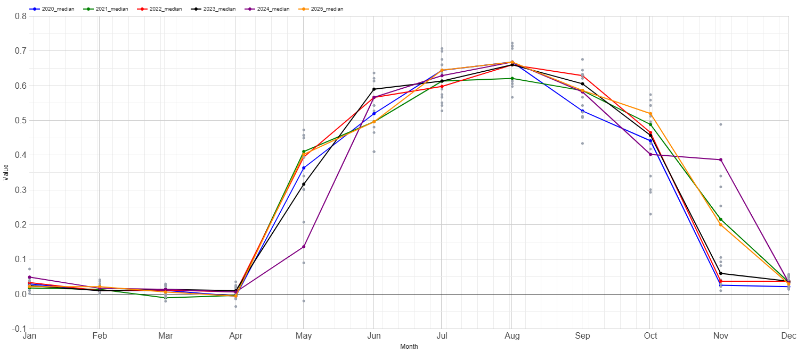
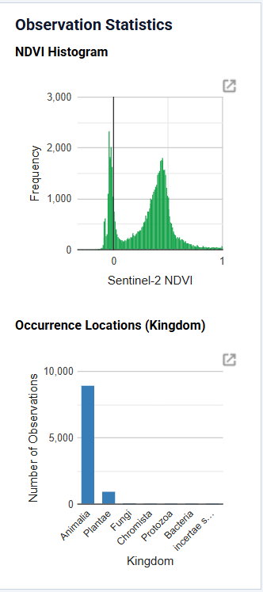

# Hudson Bay Lowlands (HJBL) Geospatial Dashboard

## Application Overview

This is a highly interactive, full-stack geospatial web application built natively on the Google Earth Engine (GEE) JavaScript API. It serves as a comprehensive environmental and climatic data dashboard for the Hudson Bay Lowlands (HJBL). The architecture allows researchers to perform complex spatial and temporal analyses across a custom 100km x 100km grid system without needing to write or manage any backend code.

[View Live Application 🔗](https://snhsadi.projects.earthengine.app/view/hjbl-2026){ .md-button .md-button--primary }

---

## Core Features & Functionality

### Dynamic Time-Lapse Generation
Users can render animated Time-Lapse GIFs for isolated 100km grids or generate macro-level timelapses of the entire Hudson Bay region.

*A broader look at the MODIS NDVI timelapse across Canada.*

*Macro-level NDVI timelapse showing regional variations across the Hudson Bay Lowlands.*

*Grid-level isolation to observe fine-scale temporal changes in NDVI.*

### Advanced Temporal Analysis & Satellite Tracking
Generates on-the-fly, historical trend charts using satellite indices and climate data (e.g. 30-year historical climate trend bar charts). It builds multi-year overlapping trend lines, calculating median and interquartile ranges (IQR) dynamically.

*Detailed temporal trend analysis of NDVI across selected grids.*

### Observation Statistics & Biodiversity Mapping
Integrates GBIF occurrence data and other spatial datasets, rendering statistical arrays and charts to explore biodiversity and dataset distributions by biological Kingdom.

*Automated histogram rendering and observation statistics for biodiversity and other grid data.*

### Data Extraction & Export
Features a backend URL generator that processes the active grid geometry and dataset parameters to output a secure download link for raw GeoTIFF files directly to the user.

## Dataset Integrations & Data Engineering

The dashboard seamlessly fuses and maps multiple heavy datasets, applying complex reducers and custom visualization parameters:

*   **Multi-Sensor Optical & SAR**: Sentinel-2 (NDVI, NDWI, LAI) and Sentinel-1 (fused with optical for a custom SAR-Optical Water Index/SOWI).
*   **Carbon & Topography**: MODIS (NPP and GPP estimation) and Canadian DEM.
*   **Climatic & Land Cover**: ESA WorldCover (10m resolution), WorldClim V1 Monthly, and ECMWF ERA5 Monthly Aggregates.

## UI/UX Architecture

*   Built entirely with GEE UI components (`ui.Panel`, `ui.Chart`, `ui.Select`).
*   Features dynamic legend generation, automated histogram rendering for observation statistics, and state-managed dataset switching.
*   Implements scalable vector graphics (SVG) for map labels and custom-styled ecoregion basemaps.
