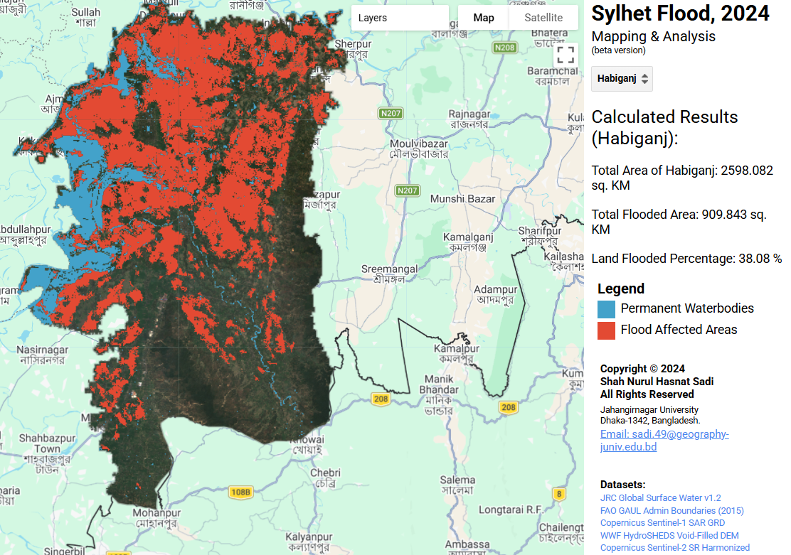
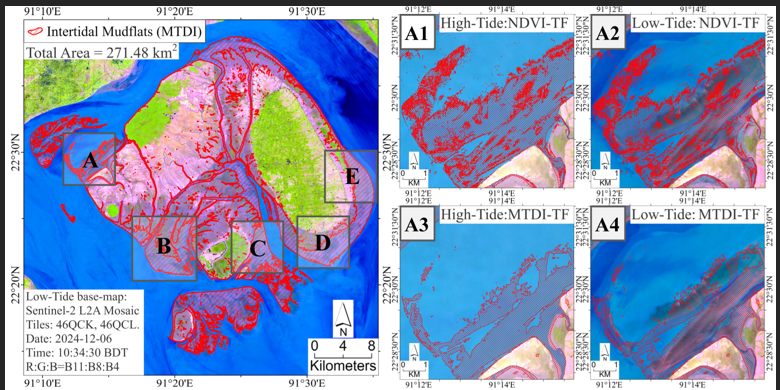
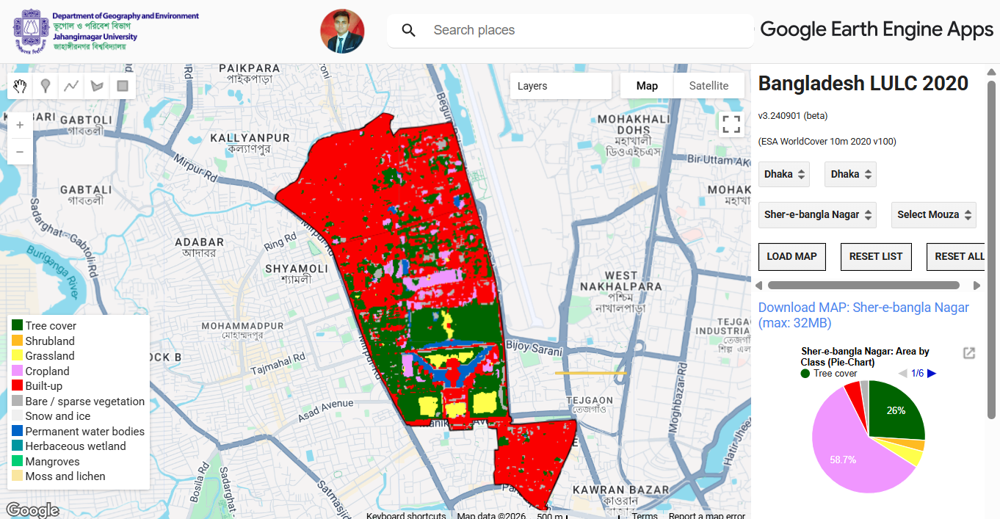

---
hide:
  - toc
---
<!--
CHECKLIST FOR THIS PAGE:
- [ ] Replace the two placeholder cards (marked [YOUR PROJECT ...]) with your real projects
- [ ] For each project: add a thumbnail image to docs/assets/images/ and update the path below
- [ ] For each project: create a project page by copying sample-project.md
- [ ] For each project: add a nav entry in mkdocs.yml (see the comments there)
- [ ] Delete placeholder cards you don't need yet
-->

# Projects

A selection of my geospatial projects. Click any card to see the full write-up.

**[Sylhet Flood Mapping & Analysis (2024)](sylhet-flood-2024.md)**

This project provides a rapid-response mapping and quantitative analysis of the 2024 floods in the Sylhet Division, Bangladesh. Using cloud-based geospatial processing in Google Earth Engine (GEE), the application dynamically calculates total inundated areas and flood percentages at the district level.

`Google Earth Engine` `Sentine-1 SAR`

[View Project →](sylhet-flood-2024.md){ .md-button }

**[Automated Intertidal Mudflat Mapping: MSIC-Otsu & MTDI](mudflat-2024.md)**

Mapping intertidal mudflats is notoriously difficult due to constant tidal fluctuations and high water turbidity. This project introduces an automated, highly scalable pipeline to dynamically extract tidal flat extents in the Meghna Estuary (Dry Season 2024-2025). By iterating through specific temporal percentiles and applying dynamic thresholding, the algorithm isolates mudflats without requiring hard-coded, static index values.

`Google Earth Engine` `Sentinel-2` `MTDI`

[View Project →](mudflat-2024.md){ .md-button }

**[Gender Specific Single-Age Population Database (2025)](single-pop.md)**

Developed a Python notebook in Google Colab to process and analyze 4.8 million rows of national population census data to produce a compact gender-wise single age population database for 60,420 geocodes of Bangladesh.

`Python` `Google Colab` `Data Processing`

[View Notebook →](single-pop.md){ .md-button }

**[GEE APP: 10-class Interactive LULC-Explorer for Bangladesh (2024)](bd-lulc.md)**

Enabled visualization and download of 10-class LULC raster tiles (max 32 MB) for 8 Divisions to 5,160 Thanas in Bangladesh along with 2 infographics, utilizing the "ESA World Cover - 2020" database.

`Google Earth Engine` `LULC` `Web App`

[View Application →](bd-lulc.md){ .md-button }

**[Quantifying Aboveground Carbon Stock (2025)](carbon-stock.md)**

Quantifying aboveground carbon stock at the species level using TLS LiDAR and UAV photogrammetry for urban trees.

`LiDAR` `UAV` `Photogrammetry`

[View Project →](carbon-stock.md){ .md-button }

