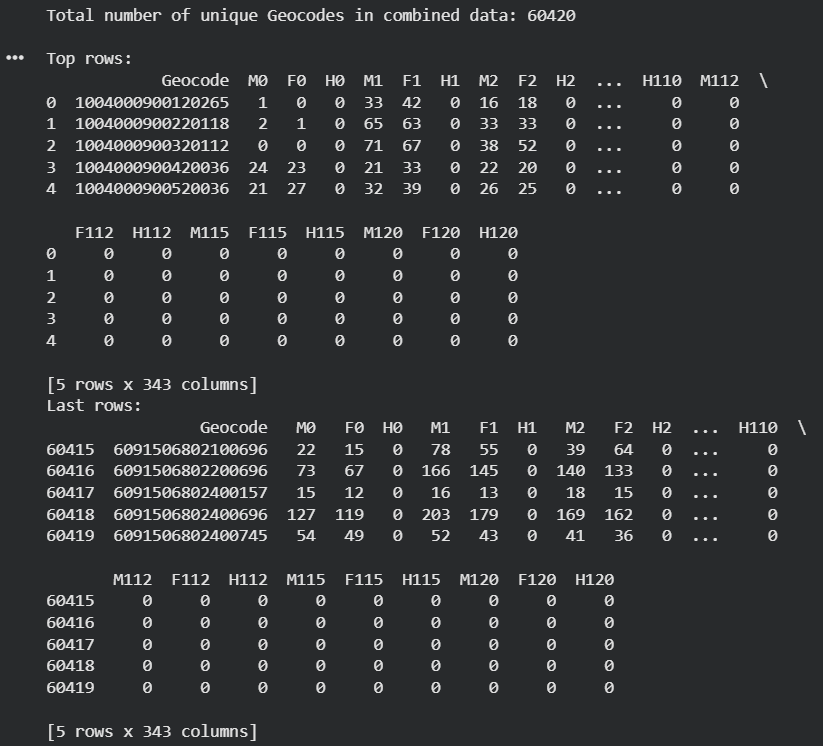

# Gender Specific Single-Age Population Database (2025)

## Overview

Developed a Python notebook in Google Colab to process and analyze 4.8 million rows of national population census data to produce a compact gender-wise single age population database for 60,420 geocodes of Bangladesh.

**Study Area:** Bangladesh
**Data:** National Population and Housing Census of Bangladesh, 2022
**Status:** Completed (January 2025)

---

## Methods & Tools

**Processing Steps**

1. Acquired 4.8 million rows of national population census data.
2. Cleaned and preprocessed data to handle missing values and inconsistencies.
3. Aggregated the data to calculate gender-specific single-age populations.
4. Mapped the population statistics to 60,420 distinct geocodes across Bangladesh.
5. Exported the final compact database for geospatial analysis and demographic mapping.

**Tools Used**

- **Python**: Core programming language.
- **Google Colab**: Cloud-based notebook environment for data processing.
- **Pandas**: Used for data manipulation, aggregation, and filtering.

---

## Links

[View Notebook 🔗](https://colab.research.google.com/drive/1L335UzXzF-3obZklyJE4MxDxUJd2BOLC?usp=sharing){ .md-button }
